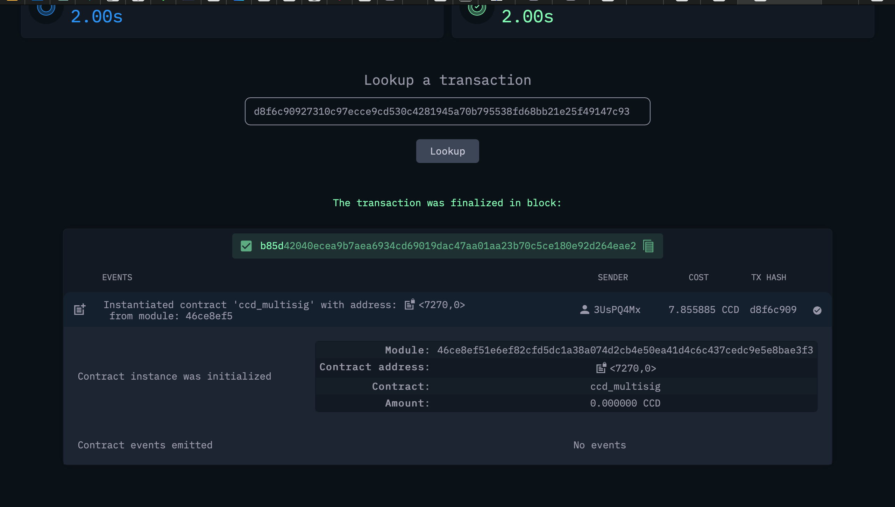
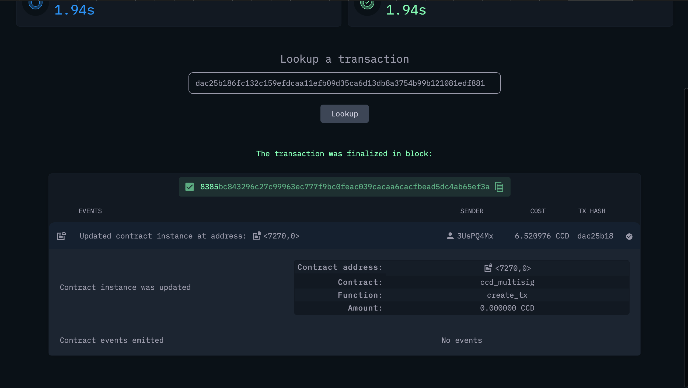
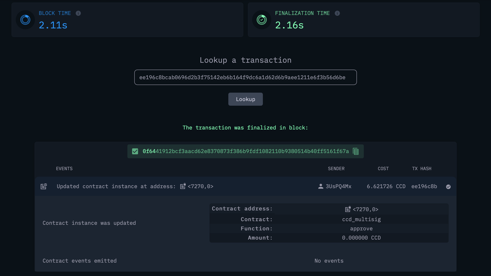
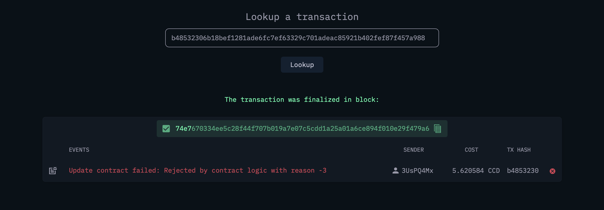
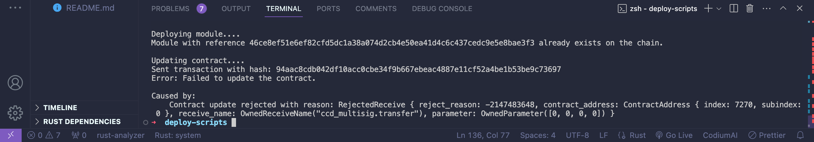
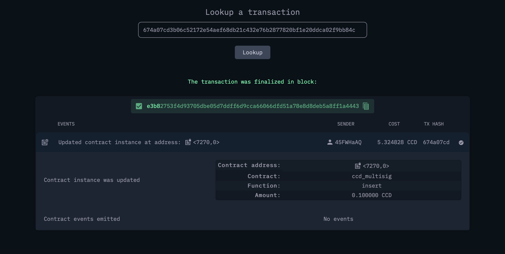
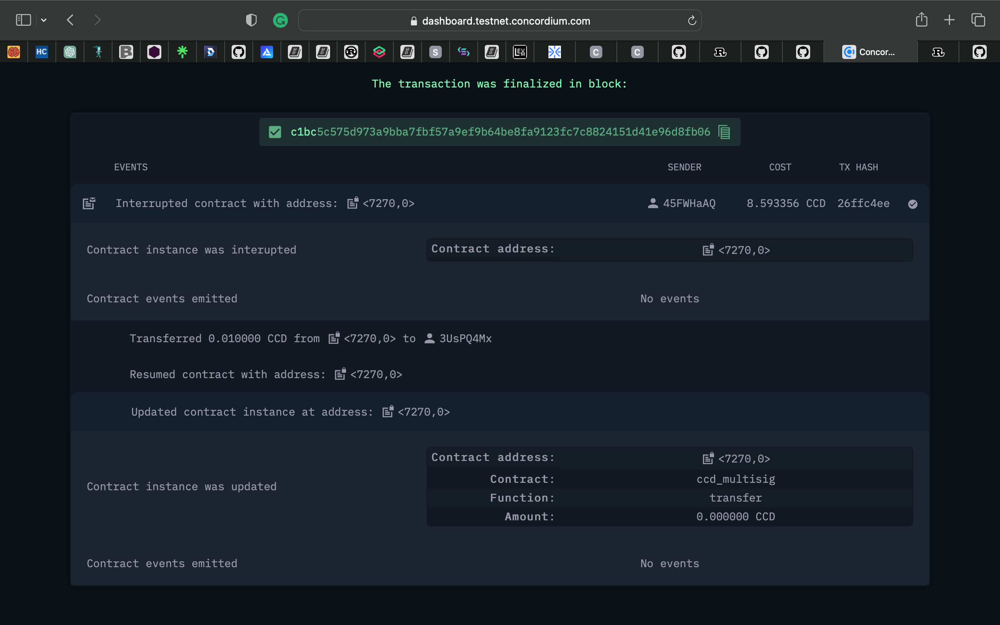

# multis-contract
# Introduction

This project simulates a multi signatory smart contract on the concordium blockchain. it also contains scripts that interacts with the blockchain(testnet). 


# Functionalities of the Smart Contract

The smart contract code has support for the following functionalities:

Write functions:
- `init()`: To initalize the smart contract and build state using the initial parameters.
- `insert()`: Allows the smart contract to receive ccd tokens.
- `create_tx()`: Creates a transaction proposal pending approval from the signatories.
- `approve()`: Approves a transaction proposal, can only be called by a signatory.
- `transfer()`: Excutes a transaction if proposal is approved by all signatories.


Read functions:

- `view()`: To check the state of a deployed smart contract, returns a transaction proposal when given an tx_id.
- `get_admins()`: Returns all the signatory of a Smart contract module.
- `get_votes_remaining()`: Returns the number of approvals needed for transaction to be excuted.


# Running the code
The code was deployed and initialized and updated with the following command: 
```
cargo run -- --node http://node.testnet.concordium.com:20000 --account ~/3UsPQ4MxhGNLEbYac53H7C2JHzE3Xe41zrgCdLVrp5vphx4YSe.export --module ~/ccd-multisig/concordium-out/module.wasm.v1

```
The code ran succesfully and returned a module reference, a initialization transaction hash and an updated transaction hash.

```
Deploying module....
Sent transaction with hash: 4174273c3a67dd85e0dddba27f1e4a8cbe17ed818cfe265a42b7a113f75ccbc1
Transaction finalized: tx_hash=4174273c3a67dd85e0dddba27f1e4a8cbe17ed818cfe265a42b7a113f75ccbc1 module_ref=46ce8ef51e6ef82cfd5dc1a38a074d2cb4e50ea41d4c6c437cedc9e5e8bae3f3

Initializing contract....
Sent transaction with hash: d8f6c90927310c97ecce9cd530c4281945a70b795538fd68bb21e25f49147c93
Transaction finalized: tx_hash=d8f6c90927310c97ecce9cd530c4281945a70b795538fd68bb21e25f49147c93 contract=(7270, 0)

Updating contract....
Sent transaction with hash: dac25b186fc132c159efdcaa11efb09d35ca6d13db8a3754b99b121081edf881
Transaction finalized: tx_hash=dac25b186fc132c159efdcaa11efb09d35ca6d13db8a3754b99b121081edf881
```
A screenshot of the contract deployment on the concordium block explorer


A Screenshot of Contract Initialization on the block explorer 


A screenshot of Contract Update(creating a transaction proposal) on the concordium block explorer.


Next we simulate approving the transaction proposal on the smart contract, a signatory can only approve a given transaction once while a none signatory cannot approve a transaction. Calling the `approve()` function with a signatory account returns successful with the transaction hash ```ee196c8bcab0696d2b3f75142eb6b164f9dc6a1d62d6b9aee1211e6f3b56d6be```.

if we try to approve the contract again with the same signatory the transaction fails as can be seen here
```b48532306b18bef1281ade6fc7ef63329c701adeac85921b402fef87f457a988```.

Also if a signatory tries to execute a transaction without complete approval from all signatory the transactions reverts as can be seen here ``` 94aac8cdb042df10acc0cbe34f9b667ebeac4887e11cf52a4be1b53be9c73697``` 

The remaining signatories signs and approves the transaction here ```149a68779bcd753e9770c858663d4d965e1b69655ee3683264dc1a33b20e8e55``` and here ```83e5ac63c44ebb8068d0fcfdff9cdb6e89945d49007681d34bb7396b7ca3e353```

Now that the transaction has been approved, we will attempt to excute the transaction. At first the transcation fails here `cee9c225daf4f2d896dbcd1abedb6e537c3d39144262ab0460e6bce2c0f55b44` because the smart contract has no ccd in it. so we sent some ccd to the contract here with the `insert()` function `674a07cd3b06c52172e54aef68db21c432e76b2877820bf1e20ddca02f9bb84c`.


Finally, we call execute the transaction here by calling the `transfer()` function. The transfer executes successfully with this transaction hash `26ffc4ee9377046f4db0d3548ba48abcb404f22994c648da49c3ba20fa0aae4a` and the screenshot of transfer below. 


Security Check:
  1. Only Signatories can approve a transaction proposal.
  2.  Signatories can only approve a transaction proposal once.
  3.  State changes before execution of transfers to avoid re entrancy attack.

Signatories accounts used for this demonstration are:

```
3UsPQ4MxhGNLEbYac53H7C2JHzE3Xe41zrgCdLVrp5vphx4YSe
45FWHaAQz44w5VrcrX7XUeNHGwTvPHWRZGSUsdekqyw44Tz2iu
36J5gb5QVYBvbda4cZkagN4LvVCXejyX8ScuEx8xyAQckVjBMA
```
